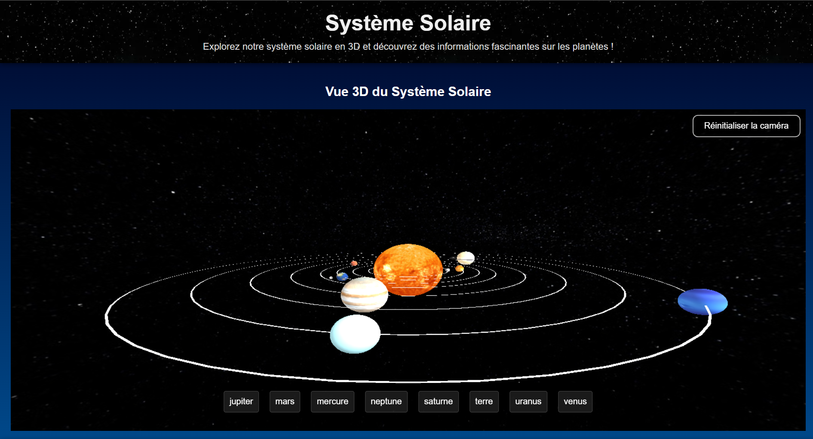

Projet de groupe : Stella, Lila, Moi-même :D
Représentation du système solaire en 3D sous forme d'une documentation avec chaque information de nos planètes dans le système solaire ex : température, taille, satellites naturels etc
Ce code est principalement fait en THREE.js et en JS

